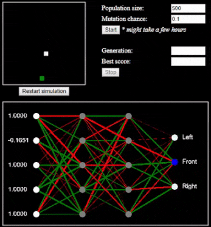

# Jake the Snake

Snake game - neural network trained with genetic algorithtm (+ single player)

## Getting Started

No dependencies, pure javascript. Just open index.html in browser.
Live site: http://bytecode.hr/p/jake-the-snake/

### Neural network

Neural network contains 5 input neurons, 2 layers of hidden neurons and 3 output neurons. Inputs are:
 * Bias (1)
 * Angle to the food in respect to the current snake direction
 * Is left square empty (0/1)
 * Is front square empty (0/1)
 * Is right square empty (0/1)

Output is calculated and neuron with highest value determines the next step:
 * neuron 1 - turn left
 * neuron 1 - no change in direction
 * neuron 1 - turn right

### Genetic algorithm

Genetic algorithm is used to "train" the neural net. Genome is represented by an array of weights between the neurons.
Initial population is created with random weights and each NN is scored by how much has snake progressed (how much it grew). If snake does not eat an apple in certian amount of moves it dies and NN is penalized for it.

When entire population has been evaluated NNs are sorted by its score and worst 50% are discarded and replaced with new NN created by crossing over two random parents. Crossover is done by randomly selecting weights (array of floats) from both parents.

#### Results

Training in browser is slow and results really depend on the initial population. NN shown in the gif at the top had a best score after 67726 generations and about 2 hours of training.
